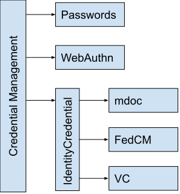

  
# Identity Credential

## Problem

There are multiple ways to present credentials on the web, and more being proposed. It may be that some use cases (like age verification or university affiliation) will be able to be met by multiple different approaches, but existing API designs could mean that users are forced to choose which technology to use without necessarily having the context to easily make that choice. Eg. websites might be forced to present options like "Click here to prove your employer with the identity in your wallet app" and "Click here to login to your company's server to prove your employment". It seems there's an opportunity to create some common groundwork now which could help enable websites to more often simply say "Click here to prove your employer" and let the browser and OS figure out what options are best presented for this specific user.

## Proposal 

This document contains an explainer for `IdentityCredential`—a credential type in the [Credential Management](https://www.w3.org/TR/credential-management-1/) framework for all types of identity verification. Types of identity credentials would extend `IdentityCredential` in the same way that different authentication methods extend [Credential Management](https://www.w3.org/TR/credential-management-1/) today.



In this proposal, we lift `IdentityCredential` out of [Federated Credential Management](https://fedidcg.github.io/FedCM/) (FedCM). FedCM would be one extension of `IdentityCredential` but user agents would not need to implement FedCM in order to support other types of identity credentials.

This proposal is informed by a few design points:

1. identity credentials are going to come in multiple formats, determined in part by legislation and non-web standards
1. some browsers may choose to be largely agnostic to the credential format, acting mostly as a conduit for the underlying platform or wallet applications
1. identity verification is not authentication

First, `IdentityCredential` supports multiple identity verification schemes because we envision that sites may want to support multiple identity types in a single identity credential picker while retaining some influence over the order in which they are presented to the user.

For example, student university affiliations are often asserted via [SAML](https://www.oasis-open.org/committees/download.php/56776/sstc-saml-core-errata-2.0-wd-07.pdf) today, but student IDs are going to be increasingly made available in wallet apps ([example](https://www.purdue.edu/newsroom/releases/2023/Q2/purdue-launches-purdue-mobile-id-for-students-allowing-them-to-get-around-campus-with-just-a-simple-tap-of-their-mobile-device.html)) and so could be verifiable credentials (e.g. [mdocs](https://www.ul.com/resources/new-isoiec-standard-electronic-credentials) or [W3C VCs](https://www.w3.org/TR/vc-data-model/)) in the future. An online library (e.g. nature.com) that needs users to prove their student affiliations may need to support both mdocs and federation in order to support students from multiple institutions.

Second, we think it is key to make requests for identity verification different from requests for authentication. The former is (potentially) a much more significant operation because it may disclose an irrevocable, cross-site identity. Because of this we considered building a `navigator.identity` namespace but ultimately decided to use [Credential Management](https://www.w3.org/TR/credential-management-1/), and thus `navigator.credentials`. This was because FedCM already uses `navigator.credentials.get({identity: …})` and thus the term `identity` would appear twice in the Web Platform if `navigator.identity` was added. But the use of `identity` for `IdentityCredential` was not a mistake: federation, and thus FedCM, provides identity verification and over time we would like authentication to be handled by [`PublicKeyCredential`](https://www.w3.org/TR/webauthn-2/#iface-pkcredential) (e.g. &ldquo;passkeys&rdquo;). However, today, FedCM is used for authentication too and so it lives in `navigator.credentials`. 

Thus we want to support identity requests that can be satisfied by either mdocs or federation, and authentication requests that can be satisfied by either passwords, passkeys, or federation. This implies that all those mechanisms end up in `navigator.credentials` and that has informed this design.

All identity requests are grouped together, rather than made top-level types in Credential Management, to communicate that they are separate from the authentication mechanisms. In general, user agents that receive a request that combines authentication and identity verification, e.g. a request for either an mdoc or a passkey, SHOULD immediately reject such requests with a `NotSupportedError` exception.

## The IdentityCredential Interface

`IdentityCredential` is a new type of [Credential](https://w3c.github.io/webappsec-credential-management/#credential):

```webidl
[Exposed=Window, SecureContext]
interface IdentityCredential : Credential {
  readonly attribute USVString? token;
};
```

[CredentialRequestOptions](https://w3c.github.io/webappsec-credential-management/#dictdef-credentialrequestoptions) is extended with a new member for identity requests:

```webidl
partial dictionary CredentialRequestOptions {
  IdentityCredentialRequestOptions identity;
};
```

`IdentityCredentialRequestOptions` mirrors the pattern of Credential Management and is extended with a list of identity verification providers:

```webidl
dictionary IdentityCredentialRequestOptions {
  // Common request fields, e.g. the context API.

  sequence<IdentityProviderConfig> providers;
}
```

`IdentityProviderConfig` represents a scheme-specific source of identity credentials, and it expected to be extended by other specifications (e.g. the federated or mdocs scheme).

```
dictionary IdentityProviderConfig {
  // More common fields across all identity provider types:
  // ...
};
```

As an illustrative example, the definition of an identity scheme would add members to that dictionary:

```webidl
partial dictionary IdentityProviderConfig {
  WalletProvider holder;
}

dictionary WalletProvider {
  // A query selector that is used by wallets to filter credentials for
  // selection.
  WalletSelector selector;

  // An opaque map of parameters sent to wallets upon selection.
  record<USVString, USVString> params;
};

dictionary WalletSelector {
  // A list of desired formats for the credential.
  sequence<USVString> format;
  // The top-level type of document (e.g. a passport, driver's license, etc).
  DOMString doctype;
  // The amount of time the verifier intends to retain the credential.
  // Omitting `retention` implies that the identity information will not be stored.
  // How long the verifier intends to retent the credential.
  WalletStorageDuration retention;
  // The requested fields.
  sequence<(WalletFieldRequirement or DOMString)> fields;
};

dictionary WalletFieldRequirement {
  required DOMString name;
  DOMString equals;
};

dictionary WalletStorageDuration {
  // Exactly one of the following must be provided.
  boolean forever;
  long days;
};
```

When [DiscoverFromExternalSource](https://w3c.github.io/webappsec-credential-management/#dom-credential-discoverfromexternalsource-slot) is invoked, the `DiscoverFromExternalSource` function of each of the different identity providers  specified in the `IdentityCredentialRequestOptions.providers` is run in parallel. If any throws an error then that error is the result of `IdentityCredential`'s DiscoverFromExternalSource. If one or more return an `IdentityCredential` then the user agent picks one of the values as the result, as its discretion. Otherwise the result is `null`.

## Examples

These are examples of extensions to `IdentityCredential` that we would expect, and how / why they'd fit together.

- [mdocs](#mdocs)
- [FedCM](#fedcm)
- [W3C Verifiable Credentials](#w3c-verifiable-credentials)

### MDocs

The [MDocs API](https://github.com/agl/mobile-document-request-api/tree/identityapi#examples) extends the `IdentityCredential` API to allow mdocs to be requested:

```js
// Gets a CBOR with specific fields out of mobile driver's license as an mdoc
const {response} = await navigator.credentials.get({
  identity: {
    providers: [{
      holder: {
        selector: {
          retention: {days: 90},
          doctype: "org.iso.18013.5.1.mDL",
          fields: [
            "org.iso.18013.5.1.document_number",
            "org.iso.18013.5.1.portrait",
            "org.iso.18013.5.1.driving_privileges",
            "org.iso.18013.5.1.aamva.organ_donor",
          ],
        },
        params: {
          nonce: "gf69kepV+m5tGxUIsFtLi6pwg=",
          readerPublicKey: "ftl+VEHPB17r2 ... Nioc9QZ7X/6w...",
        }
      }
    }],
  }
});
```

### FedCM

The [FedCM](https://fedidcg.github.io/FedCM/) also extends the `IdentityCredential` API to provide a binding to [OpenID](https://openid.net/specs/openid-connect-core-1_0.html) and [SAML](https://seamlessaccess.org/posts/2023-02-20-fedcm/): 

```js
// Gets a JWT from a OIDC provider. 
const {response} = await navigator.credentials.get({
  identity: {
    providers: [{
      federated: {
        configURL: "https://university.edu/students",
        clientId: "123",
        nonce: "m5tGxUIsFtLi6pwg"
      }
    }]
  }
}
```

### W3C Verifiable Credentials

We also expect that we'd at some point extend `IdentityCredential` to provide a binding to [CHAPI](https://github.com/fedidcg/FedCM/issues/374) and [OIDC4VP](https://openid.net/specs/openid-connect-4-verifiable-presentations-1_0-07.html).

While this is still something that we are actively exploring with that community ([example](https://w3c-ccg.github.io/meetings/2023-01-24/) and early [proposal](https://github.com/fedidcg/FedCM/issues/374)), here is a possible example of what that could look like:

> It is worth noting how closely related this looks to the [mdocs](#mdocs) extension.

```js
// Gets a SD-JWT from a W3C VC holder.
const {response} = await navigator.credentials.get({
  identity: {
    providers: [{
      holder: {
        format: ["vc+sd-jwt"],
        selector: [{
          doctype: "UniversityDegreeCredential",
          fields: [        
            "credentialSubject.dateOfBirth",
            "credentialSubject.dob",
            "vc.credentialSubject.dateOfBirth",
            "vc.credentialSubject.dob",                     
          ]
        }],
        params: {
          nonce: "m5tGxUIsFtLi6pwg",
        }
      },
    }]
  }
}
```

### Reconcilation

User agents can support multiple identity schemes, and they can be requested at the same time:

```js
// Requests a verifiable affilitation to a university, accepting mdocs,
// W3C VCs and SAML assertions.
const credential = await navigator.credentials.get({
  identity: {
    // Requests the user's university affiliation from either 
    // a W3C VC, an MDoc or a JWT.
    providers: [{
      // The university may have a device-bound certificate ...
      holder: {
        selector: {
          retention: {days: 90},
          doctype: "org.iso.18013.5.1.UniversityDegree",
          fields: [
            "org.iso.18013.5.1.affiliation",
          ],
        },
        params: {
          nonce: "1234",
          readerPublicKey: "...ftl+VEHpdNioc9QZ7X/6w...",
        },
      }
    }, {
      // ... or a SAML assertion ...
      federated: {
        clientId: "myapp",
        nonce: "1234",
        configURL: "https://idp.university.edu",
      }
    }, {
      // ... or a Verifiable Credential ...
      holder: {
        selector: {
          doctype: "UniversityDegreeCredential",
          fields: [
              "credentialSubject.alumniOf",                 
          ]
        }
      },
    }]
  }
});

```
